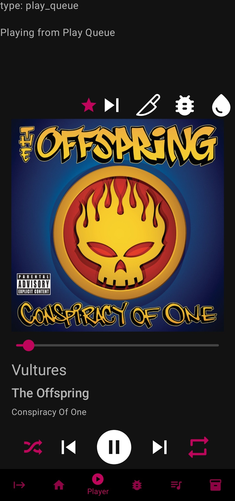

# Gridline
This is an app that uses [Spotify-Web-Api-Kotlin](https://github.com/adamint/spotify-web-api-kotlin) 
and Jetpack Compose (https://developer.android.com/jetpack/compose) to redesign the Spotify UI. 
Specifically, it focuses on adding quick-action buttons and a fully customizable home screen, 
as well as eliminating other frustrations, all with a clean, usable interface. 
No more having to scroll past podcasts you'll never listen to.
Gridline also provides utils for shuffling and quickly editing Spotify playlists. 
This will eventually provide all of the functionality provided by 
[my Python, terminal-based Spotify shuffler](https://github.com/Lightningtow/Spotify_Shuffler).

It is still in alpha, under heavy development. Many functionalities have not been implemented yet, but it's coming along quickly. 
Nowadays, I use Gridline instead of the actual Spotify app.
Screenshots:  

